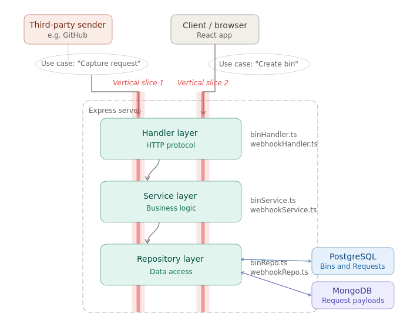
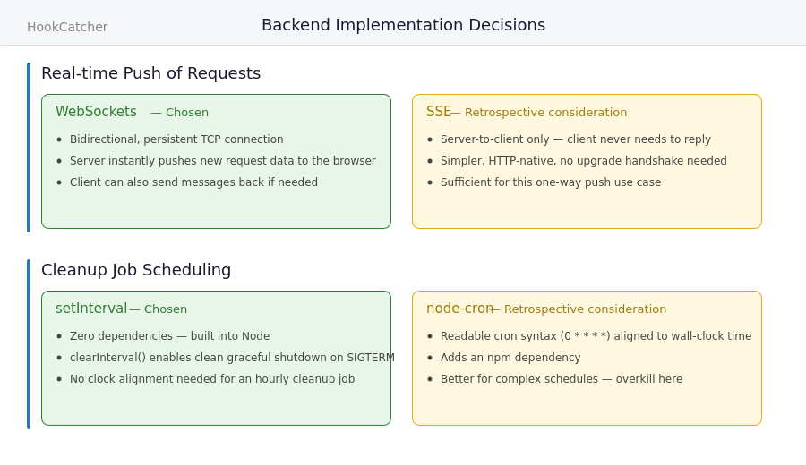

# HookCatcher Backend

Express + TypeScript backend for HookCatcher, a RequestBin-style webhook capture tool.

### Prerequisites

- Node.js (v18 or later)
- npm

### Setup

1. Clone the repo and install dependencies:

   ```bash
   npm install
   ```

2. Start the development server:

   ```bash
   npm run dev
   ```

   The server will start on `http://localhost:3000` (or whatever `PORT` is set to in `.env`). Nodemon will watch for file changes and restart automatically.

### Available Scripts

| Script          | Description                             |
| --------------- | --------------------------------------- |
| `npm run dev`   | Start dev server with nodemon + ts-node |
| `npm run build` | Compile TypeScript to `dist/`           |
| `npm start`     | Run the compiled JS from `dist/`        |

### Database Setup

- PostgreSQL stores relational data about created bins and incoming requests stored in them.
- MongoDB stores the raw webhook request payloads as blobs.

Connection files for both databases are in `src/db_connections`, each in their corresponsing subdirectories.

#### Environment Variables

1. Create a `.env` file in the `server` root of the project (listed under `.gitignore` - never commit). `.env.example` can be used as a template. Connection modules use default values when the environment variables have not been set. To copy the development content directly from `.env.example` to `.env`:

   ```bash
      cp .env.example .env
   ```

If you're not sure what username and password to use:

```bash
# get your username
psql -c "SELECT current_user;"

# set a new password (be sure to write it down!)
psql -c "ALTER USER <username> PASSWORD '<new_passowrd>';"
```

#### Running databases locally

Background info:

- `mongod` / `postgresql` are the server processes
- `mongosh` / `psql` are the client applications that allow you to connect to the server via your shell

##### MacOS

1. To install and run PostgreSQL:

   ```bash
   brew install postgresql
   brew services start postgresql
   ```

2. To install and run MongoDB:

   ```bash
   brew tap mongodb/brew
   brew install mongodb-community
   brew services start mongodb-community
   ```

3. To ensure both databases are running:
   ```bash
   brew services list
   ```

Both `postgresql` and `mongodb-community` should be listed with a status of `started` after the above command is run.

##### Linux

Written for Ubuntu 22.04 LTS, may vary for other OS

Check to see if it's already installed

```bash
psql  # should launch the postgresql client without errors
# or
dpkg -l postgresql postgresql-contrib  # should list both packages & versions
```

To install and run PostgreSQL:

```bash
sudo apt update
sudo apt install postgresql postgresql-contrib
sudo systemctl status postgresql  # service should be running
```

If the service isn't running, then start it and enable run on startup:

```bash
sudo systemctl start postgresql
sudo systemctl enable postgresql
```

To install and run MongoDB:
Follow the [instructions](https://www.mongodb.com/docs/manual/administration/install-community/?operating-system=linux&linux-distribution=red-hat&linux-package=default&search-linux=with-search-linux) for installing the MongoDB Self-managed Community Edition

Start the `mongod` process:

```
sudo systemctl start mongod
```

Expected output:

```bash
$ sudo systemctl status mongod
● mongod.service - MongoDB Database Server
     Loaded: loaded (/lib/systemd/system/mongod.service; disabled; vendor preset: enabled)
     Active: active (running) since Wed 2026-03-11 17:45:11 EDT; 1s ago
       Docs: https://docs.mongodb.org/manual
   Main PID: 44647 (mongod)
     Memory: 102.0M
        CPU: 406ms
     CGroup: /system.slice/mongod.service
             └─44647 /usr/bin/mongod --config /etc/mongod.conf
```

If you get an error with `status=14`, try enabling read permissions and re-trying:

```bash
sudo chown -R mongodb:mongodb /var/lib/mongodb
sudo chown -R mongodb:mongodb /var/log/mongodb
sudo chown mongodb:mongodb /tmp/mongodb-27017.sock
```

3. To ensure both databases are running:
   ```bash
   sudo systemctl status postgresql mongod
   ```

### Prep the databases for first run

#### Postgres

Create the database and ensure the creation was successful:

```bash
sudo -u postgres createdb hookcatcher

# this is just one way to verify success
sudo -u postgres psql -l | grep hookcatcher
```

Create user and assign priveleges
```bash
GRANT ALL PRIVILEGES ON ALL TABLES IN SCHEMA public TO <username>;
GRANT ALL PRIVILEGES ON ALL SEQUENCES IN SCHEMA public TO <username>;
```

Create the schema

```bash
# assumes that you're in the project root
psql -d hookcatcher -f ./src/db_connections/postgres/schema.sql
```

#### Mongo

No manual setup is needed for MongoDB. Unlike PostgreSQL, MongoDB creates databases and collections automatically on first write. As long as mongod is running, the app will auto-create the hookcatcher database and request_payloads collection when the first webhook is captured.

### Backend Structure

```
src/
├── index.ts          # Server entry point (listen)
├── app.ts            # Express app config and middleware
├── handlers/         # Route handlers (controllers)
├── services/         # Business logic
├── db_connections/   # Database queries (PostgreSQL + MongoDB)
```

**Handler → Service → Repo(db_connections)** — handlers receive HTTP requests and delegate to services, services contain business logic and delegate to repos, repos talk to the databases.



### Design Decisions


